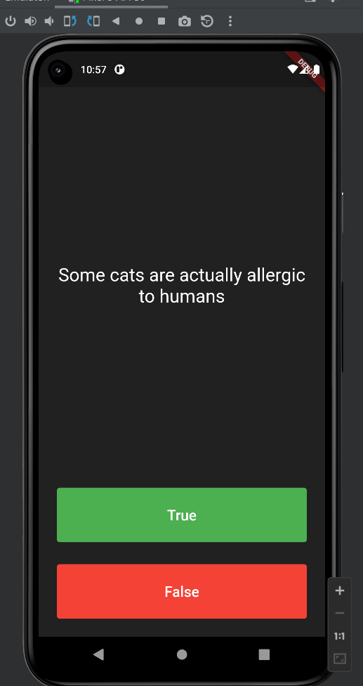

# Quizzer Flutter

It is my 6th flutter app while learning the flutter. It is
Quiz App with 13 Questions.

## Functionality:

##  It is a Simple Quiz which will ask you 13 Question and Shows you result based on it.

## Learning 

I have learned and Used in this Project

1.  list

2.  class

3.  Inheritance

4.  Abstract

5.  Polymorphism

6.  Alert

## Screenshots

### Starting Screen:

### Taking Quiz:

### Success:

### Failed:

